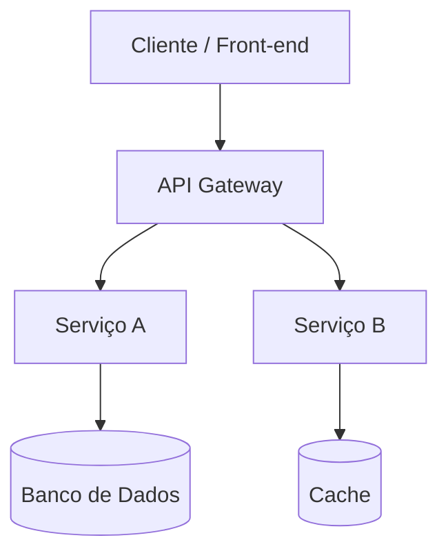
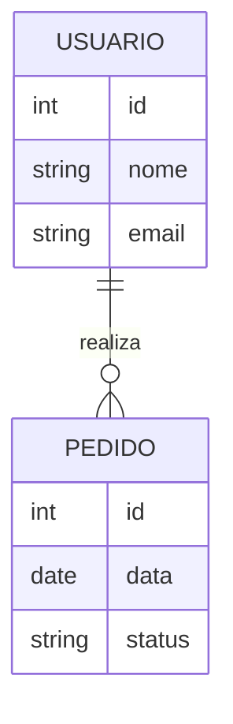

# Documentação do Software — [Nome do Projeto]

| Campo | Valor |
|---|---|
| **Versão do documento** | 1.0 |
| **Data** | DD/MM/AAAA |
| **Autor(es)** | |
| **Status** | Rascunho / Em revisão / Aprovado |
| **Aprovado por** | |

## Histórico de Revisões

| Versão | Data | Autor | Descrição da alteração |
|---|---|---|---|
| 1.0 | DD/MM/AAAA | | Criação do documento |

---

## Sumário

1. [Visão Geral](#1-visão-geral)
2. [Escopo do Projeto](#2-escopo-do-projeto)
3. [Requisitos Funcionais](#3-requisitos-funcionais)
4. [Requisitos Não Funcionais](#4-requisitos-não-funcionais)
5. [Regras de Negócio](#5-regras-de-negócio)
6. [Projeto e Arquitetura do Software](#6-projeto-e-arquitetura-do-software)
7. [Plano e Casos de Teste](#7-plano-e-casos-de-teste)
8. [Matriz de Rastreabilidade](#8-matriz-de-rastreabilidade-requisitos-x-testes-x-código-fonte)
9. [Glossário](#9-glossário)
10. [Anexos e Referências](#10-anexos-e-referências)

---

## 1. Visão Geral

### 1.1 Propósito do documento
Descreva o objetivo desta documentação e para quem ela se destina (equipe de desenvolvimento, QA, stakeholders, etc.).

### 1.2 Descrição resumida do sistema
Breve parágrafo explicando o que o sistema faz e qual problema resolve.

### 1.3 Stakeholders

| Nome / Papel | Responsabilidade | Contato |
|---|---|---|
| Product Owner | | |
| Arquiteto de Software | | |
| Time de Desenvolvimento | | |
| Time de QA | | |
| Cliente / Patrocinador | | |

---

## 2. Escopo do Projeto

### 2.1 Objetivos do projeto
Liste os objetivos de negócio que o software pretende atingir.

- Objetivo 1
- Objetivo 2

### 2.2 Dentro do escopo (In Scope)
- Item 1
- Item 2

### 2.3 Fora do escopo (Out of Scope)
- Item 1
- Item 2

### 2.4 Premissas
- Premissa 1
- Premissa 2

### 2.5 Restrições
- Restrição 1 (ex.: prazo, orçamento, tecnologia obrigatória)

### 2.6 Riscos identificados

| ID | Risco | Probabilidade | Impacto | Mitigação |
|---|---|---|---|---|
| R-01 | | Baixa/Média/Alta | Baixo/Médio/Alto | |

### 2.7 Entregáveis
- Entregável 1
- Entregável 2

---

## 3. Requisitos Funcionais

> Requisitos funcionais descrevem **o que** o sistema deve fazer.

### Convenção de ID
`RF-XX` (Requisito Funcional número XX)

### 3.1 Lista de Requisitos Funcionais

| ID | Descrição | Prioridade | Origem / Solicitante | Status |
|---|---|---|---|---|
| RF-01 | O sistema deve permitir que o usuário se autentique com e-mail e senha. | Alta | | A implementar |
| RF-02 | O sistema deve permitir o cadastro de novos usuários. | Alta | | A implementar |
| RF-03 | | | | |

### 3.2 Detalhamento de Requisito (modelo — repetir para cada RF)

#### RF-01 — Autenticação de usuário
- **Descrição:** O sistema deve permitir que o usuário realize login informando e-mail e senha válidos.
- **Ator(es):** Usuário
- **Pré-condições:** Usuário previamente cadastrado.
- **Fluxo principal:**
  1. Usuário acessa a tela de login.
  2. Usuário informa e-mail e senha.
  3. Sistema valida as credenciais.
  4. Sistema redireciona para a página inicial.
- **Fluxos alternativos / exceções:**
  - Credenciais inválidas → sistema exibe mensagem de erro.
- **Pós-condições:** Usuário autenticado e sessão criada.
- **Critérios de aceite:**
  - [ ] Login com credenciais válidas é bem-sucedido.
  - [ ] Login com credenciais inválidas é rejeitado com mensagem clara.
- **Requisitos relacionados:** RNF-02, RN-01

---

## 4. Requisitos Não Funcionais

> Requisitos não funcionais descrevem **como** o sistema deve se comportar (qualidade, desempenho, segurança etc.). As categorias abaixo seguem o modelo de qualidade da **ISO/IEC 25010**, complementado por requisitos de **conformidade legal (LGPD)**.

### Convenção de ID
`RNF-XX` (Requisito Não Funcional número XX)

### 4.1 Categorias segundo ISO/IEC 25010

A ISO/IEC 25010 define 8 características de qualidade de produto de software. Use-as para classificar cada RNF:

| Característica ISO 25010 | Subcaracterísticas | Descrição |
|---|---|---|
| **Adequação Funcional** | Completude, Corretude, Pertinência funcional | O quanto o sistema atende às funções especificadas e às necessidades reais. |
| **Eficiência de Desempenho** | Comportamento temporal, Utilização de recursos, Capacidade | Desempenho relativo à quantidade de recursos usados (tempo de resposta, throughput, uso de CPU/memória). |
| **Compatibilidade** | Coexistência, Interoperabilidade | Capacidade de coexistir com outros sistemas e trocar informações com eles. |
| **Usabilidade** | Reconhecibilidade, Aprendizagem, Operabilidade, Proteção contra erros, Estética, Acessibilidade | Facilidade de uso e aprendizado pelo usuário. |
| **Confiabilidade** | Maturidade, Disponibilidade, Tolerância a falhas, Recuperabilidade | Capacidade de manter um nível de desempenho sob condições especificadas. |
| **Segurança** | Confidencialidade, Integridade, Não repúdio, Responsabilização (accountability), Autenticidade | Proteção de informações e dados contra acesso não autorizado. |
| **Manutenibilidade** | Modularidade, Reusabilidade, Analisabilidade, Modificabilidade, Testabilidade | Facilidade de modificar e evoluir o software. |
| **Portabilidade** | Adaptabilidade, Instalabilidade, Substituibilidade | Facilidade de transferir o software entre ambientes. |

### 4.2 Lista de Requisitos Não Funcionais

| ID | Característica ISO 25010 | Subcaracterística | Descrição | Critério de aceite / Métrica | Prioridade |
|---|---|---|---|---|---|
| RNF-01 | Eficiência de Desempenho | Comportamento temporal | O sistema deve responder a requisições em até 2 segundos sob carga normal. | Tempo de resposta ≤ 2s (p95) | Alta |
| RNF-02 | Segurança | Confidencialidade | Senhas devem ser armazenadas com hash e salt. | Uso de bcrypt/argon2 | Alta |
| RNF-03 | Confiabilidade | Disponibilidade | O sistema deve ter disponibilidade mínima de 99,5% ao mês. | Uptime mensal | Média |
| RNF-04 | Usabilidade | Acessibilidade | | | |
| RNF-05 | Eficiência de Desempenho | Capacidade | | | |
| RNF-06 | Manutenibilidade | Testabilidade | | | |
| RNF-07 | Compatibilidade | Interoperabilidade | | | |
| RNF-08 | Portabilidade | Adaptabilidade | | | |

### 4.3 Conformidade com a LGPD (Lei nº 13.709/2018)

> Requisitos de proteção de dados pessoais tratados pelo sistema, mapeados como RNFs de **Segurança** (confidencialidade/integridade) e de **Adequação Funcional** (conformidade legal), conforme os princípios do Art. 6º da LGPD.

| ID | Princípio / Exigência LGPD | Descrição | Critério de aceite | Prioridade |
|---|---|---|---|---|
| RNF-L01 | Finalidade | Dados pessoais só podem ser coletados para finalidades específicas, explícitas e informadas ao titular. | Tela de coleta de dados exibe finalidade antes da submissão. | Alta |
| RNF-L02 | Consentimento | O sistema deve obter e registrar consentimento explícito do titular antes de coletar dados pessoais, quando essa for a base legal. | Log de consentimento com timestamp, versão do termo e IP. | Alta |
| RNF-L03 | Minimização de dados | O sistema deve coletar apenas os dados estritamente necessários à finalidade declarada. | Revisão de formulários/campos coletados vs. finalidade. | Alta |
| RNF-L04 | Direitos do titular (Art. 18) | O sistema deve permitir que o titular acesse, corrija, anonimize, exporte (portabilidade) ou solicite exclusão de seus dados. | Funcionalidade de autoatendimento ou processo com SLA definido (ex.: 15 dias). | Alta |
| RNF-L05 | Segurança e sigilo (Art. 46) | Dados pessoais devem ser protegidos com medidas técnicas e administrativas contra acessos não autorizados, perda ou vazamento. | Criptografia em trânsito (TLS) e em repouso; controle de acesso por perfil (RBAC). | Alta |
| RNF-L06 | Retenção e eliminação | Dados pessoais devem ser eliminados ou anonimizados ao final da finalidade ou período legal de retenção. | Rotina automatizada de expurgo/anonimização com registro de execução. | Média |
| RNF-L07 | Registro de operações (Art. 37) | O sistema deve manter registro das operações de tratamento de dados pessoais realizadas. | Log de auditoria com usuário, ação, dado afetado e data/hora. | Média |
| RNF-L08 | Notificação de incidentes (Art. 48) | O sistema deve possibilitar a identificação e comunicação de incidentes de segurança que envolvam dados pessoais. | Processo/procedimento de resposta a incidentes documentado e testável. | Alta |
| RNF-L09 | Privacy by Design / by Default | Configurações padrão do sistema devem privilegiar a menor exposição possível de dados pessoais. | Revisão de configurações padrão (ex.: perfis privados por padrão). | Média |
| RNF-L10 | Transferência internacional de dados | Caso haja transferência de dados para fora do país, deve haver base legal e garantias adequadas (Art. 33). | Mapeamento de fluxos de dados internacionais e cláusulas contratuais. | Baixa/Média |

**Papéis relevantes (LGPD):**

| Papel | Responsabilidade |
|---|---|
| Controlador | Define as finalidades e os meios de tratamento dos dados pessoais. |
| Operador | Realiza o tratamento de dados em nome do controlador (ex.: fornecedor de hospedagem). |
| Encarregado (DPO) | Canal de comunicação entre controlador, titulares e ANPD. |

### 4.4 Mapeamento RNF × ISO 25010 × LGPD

| ID | Categoria | Referência normativa | Requisito(s) funcional(is) relacionado(s) |
|---|---|---|---|
| RNF-02 | Segurança (ISO 25010) | LGPD Art. 46 | RF-01, RF-02 |
| RNF-L02 | Adequação Funcional / Segurança | LGPD Art. 7º, 8º | RF-02 |
| RNF-L04 | Adequação Funcional | LGPD Art. 18 | RF-XX (funcionalidade de autoatendimento do titular) |
| RNF-L07 | Manutenibilidade / Segurança | LGPD Art. 37 | RF-XX (auditoria) |

---

## 5. Regras de Negócio

> Regras de negócio são políticas, restrições ou lógicas que independem de uma funcionalidade específica e devem ser respeitadas em todo o sistema.

### Convenção de ID
`RN-XX` (Regra de Negócio número XX)

### 5.1 Lista de Regras de Negócio

| ID | Descrição | Origem | Requisitos relacionados |
|---|---|---|---|
| RN-01 | A senha do usuário deve ter no mínimo 8 caracteres, com letras e números. | | RF-01, RF-02 |
| RN-02 | Um pedido só pode ser cancelado em até 24 horas após a criação. | | |
| RN-03 | | | |

---

## 6. Projeto e Arquitetura do Software

### 6.1 Visão arquitetural
Descreva o estilo arquitetural adotado (ex.: monolito, microsserviços, serverless, camadas, hexagonal, event-driven).

### 6.2 Diagrama de arquitetura (visão geral)



### 6.3 Componentes / Módulos

| Componente | Responsabilidade | Tecnologia |
|---|---|---|
| Front-end | Interface com o usuário | |
| API / Backend | Regras de negócio e orquestração | |
| Banco de Dados | Persistência de dados | |
| Serviço de Autenticação | Login e controle de acesso | |

### 6.4 Stack tecnológica

| Camada | Tecnologia / Ferramenta | Versão |
|---|---|---|
| Front-end | | |
| Back-end | | |
| Banco de Dados | | |
| Infraestrutura / Cloud | | |
| CI/CD | | |

### 6.5 Modelo de dados
Inclua diagrama ER ou descrição das principais entidades.



### 6.6 Decisões de arquitetura (ADR resumido)

| ID | Decisão | Contexto | Alternativas consideradas | Justificativa |
|---|---|---|---|---|
| ADR-01 | | | | |

### 6.7 Estrutura de pastas do projeto

```
/src
  /api
  /domain
  /infra
  /tests
/docs
```

### 6.8 Integrações externas

| Sistema externo | Finalidade | Protocolo | Observações |
|---|---|---|---|

---

## 7. Plano e Casos de Teste

### 7.1 Estratégia de testes
Descreva os tipos de teste utilizados: unitário, integração, sistema, aceitação, carga, segurança, etc., e ferramentas empregadas.

### 7.2 Ambientes de teste

| Ambiente | Finalidade | URL / Acesso |
|---|---|---|
| Desenvolvimento | | |
| Homologação (QA) | | |
| Produção | | |

### Convenção de ID
`CT-XX` (Caso de Teste número XX)

### 7.3 Casos de Teste

| ID | Requisito relacionado | Descrição / Cenário | Pré-condições | Passos | Resultado esperado | Status |
|---|---|---|---|---|---|---|
| CT-01 | RF-01 | Login com credenciais válidas | Usuário cadastrado | 1. Acessar login 2. Inserir e-mail/senha válidos 3. Submeter | Usuário autenticado e redirecionado | A executar |
| CT-02 | RF-01 | Login com senha inválida | Usuário cadastrado | 1. Acessar login 2. Inserir senha incorreta 3. Submeter | Mensagem de erro exibida | A executar |
| CT-03 | | | | | | |

---

## 8. Matriz de Rastreabilidade (Requisitos x Testes x Código-fonte)

> Objetivo: garantir que todo requisito tenha teste(s) associado(s) e implementação identificável no código-fonte, permitindo análise de cobertura e impacto de mudanças.

| Requisito (RF/RNF/RN) | Descrição resumida | Caso(s) de Teste | Arquivo(s) / Módulo de código | Status de implementação | Status de teste |
|---|---|---|---|---|---|
| RF-01 | Autenticação de usuário | CT-01, CT-02 | `src/api/auth/login.ts` | Concluído | Aprovado |
| RF-02 | Cadastro de usuário | CT-03 | `src/api/auth/register.ts` | Em desenvolvimento | Pendente |
| RNF-01 | Tempo de resposta ≤ 2s | CT-XX | `src/infra/cache/*` | Pendente | Pendente |
| RNF-L02 | Registro de consentimento (LGPD) | CT-XX | `src/domain/consent/*` | Pendente | Pendente |
| RNF-L05 | Criptografia em trânsito/repouso (LGPD) | CT-XX | `src/infra/security/*` | Em desenvolvimento | Pendente |
| RN-01 | Regras de senha | CT-01 | `src/domain/user/password.ts` | Concluído | Aprovado |

**Legenda — Status de implementação:** Não iniciado / Em desenvolvimento / Concluído / Bloqueado
**Legenda — Status de teste:** Pendente / Em execução / Aprovado / Reprovado

> Dica: esta matriz pode ser mantida em uma planilha ou ferramenta de gestão de testes (ex.: Xray, TestRail, Zephyr) e sincronizada com este documento, ou gerada automaticamente a partir de tags nos testes automatizados (ex.: `@RF-01`) e commits/PRs vinculados aos IDs dos requisitos.

---

## 9. Glossário

| Termo | Definição |
|---|---|
| | |

---

## 10. Anexos e Referências

- Link para protótipos / wireframes:
- Link para repositório de código:
- Link para backlog / board (Jira, Trello, Azure DevOps):
- Documentos de referência:
